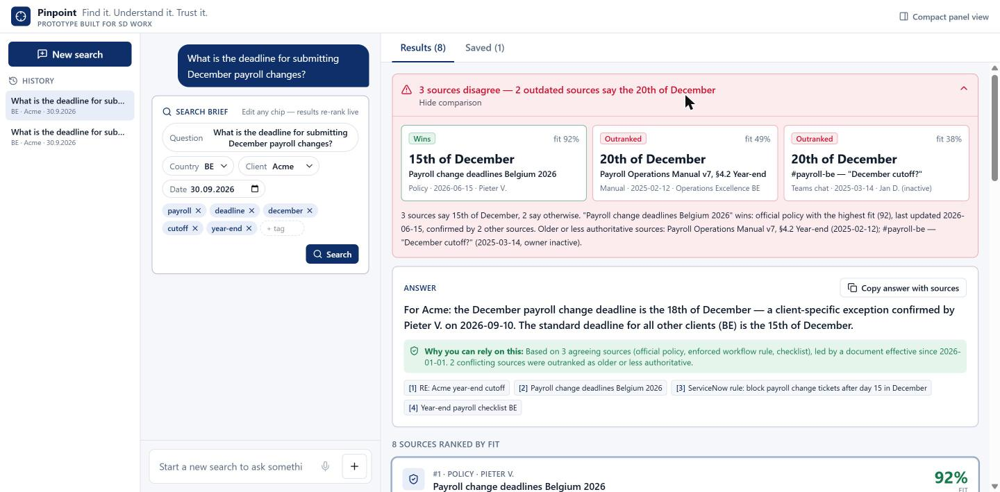
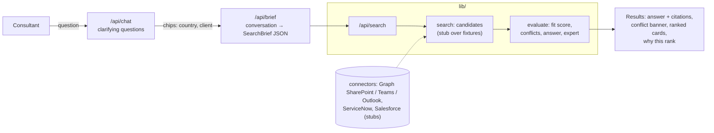

# Pinpoint — trusted knowledge finder for payroll consultants

> **Find it. Understand it. Trust it.** Ask a payroll question, get the answer from the sources you can
> actually trust — and see *why* you can trust them.

_Prototype built for the SD Worx challenge (TECTONIC hackathon)._



## The problem

Payroll consultants need instant answers ("What's the deadline for December payroll changes?"), but the
knowledge is fragmented: a 2026 policy on SharePoint, an outdated operations manual, a Teams message from a
colleague who has since left, a client-specific exception buried in an email thread, a ServiceNow rule nobody
documented. Search finds *documents*; it doesn't tell you **which one to trust**. Consultants either guess or
interrupt an expert.

## What Pinpoint does

1. **Understand** — the consultant describes what they need. The assistant asks one round of clarifying
   questions (country, client) as quick-reply chips.
2. **Structure** — the conversation becomes an editable **search brief** (question, scope, reference date,
   topic tags). Edit any chip → results re-rank live.
3. **Find** — a search module pulls candidates from all sources (policies, manuals, checklists, emails, Teams
   chats, workflows).
4. **Trust** — a deterministic, explainable scorer rates every document on **relevance, recency, scope and
   authority**, detects **conflicting claims**, and shows **why** each document ranks where it does.
5. **Answer** — one answer with citations, a "why you can rely on this" line, client-specific exceptions,
   and the **expert to ask** if you're still unsure.

Trust is never a black box: every point added or removed produces a plain-language reason
("Wrong country (NL)", "Superseded by …", "Owner is no longer active", "Contradicts … (−20)").

## How it works



### Trust score

```
fit = 100 × ( 0.40·relevance + 0.20·recency + 0.20·scope + 0.15·authority + 0.05·ownerActive )
      + up to 5 for verified working links
      − 30 if superseded − 20 if it loses a conflict − 25 if out of scope − 25 if not yet in effect
      (not clamped)
```

| Factor | How it's computed |
| --- | --- |
| Relevance | Topic-tag + keyword overlap with the brief (hook `llmRelevance()` ready for semantic scoring) |
| Recency | Centred on the brief's **"as of" date** (today if none is given; an explicit year or "December 2025" in the question sets it). A document **in effect on that date** scores 1; the further it lies before *or after* that date, the lower, halving every half-life. The half-life adapts to the documents found (median distance, never below 14 days). |
| Scope | Country mismatch → 0.1; general doc for your country → 0.8; your client's specific doc → 1.0; another client's → 0 |
| Authority | Source authority (official policy / enforced workflow 1.0 … Teams chat 0.4) |
| Links | URLs in a document's text are checked offline (`npm run check:links`); working links earn a bonus, broken ones nothing |
| Owner active | Is someone still maintaining it? |

**Time awareness:** documents that only take effect after the chosen date are flagged **Not yet in effect** and
never decide the answer; a newer version only supersedes an older one once it is in effect. Move the "as of"
date to 2027 and the 2027 policy takes over; move it to mid-2025 and the 2025 policy applies again.

**Conflicts:** documents that make the same claim (e.g. `december_cutoff_day`) with overlapping scope but
different values are compared; the highest-fit value wins, losers are penalised and explained. Client-specific
documents are treated as **exceptions**, not conflicts.

**What is shown:** the displayed fit is absolute (not "100% for the best"). Internally, scores are normalised
against the best result of the search only to hide results below **70% of the best** — they stay one click away
under "Show more".

All weights live in one object: `SCORING` in [`code/interface/lib/evaluate/index.ts`](code/interface/lib/evaluate/index.ts).

### Demo scenario

"What is the deadline for submitting December payroll changes?" — Belgium, today = 2026-09-30, 9 sources:

- Client **Acme** → *"18th for Acme (client exception, confirmed by Pieter V.); 15th for everyone else."*
- Any other client → *"15th of December."*
- Conflict: the 2025 operations manual and a Teams message ("it's the 20th") lose against the 2026 policy,
  which is confirmed by the year-end checklist and enforced by a ServiceNow rule.
- The 2025 policy is flagged **Superseded**, the Dutch policy **Wrong country**, the 2027 policy (12th)
  **Not yet in effect**.
- Set the "as of" date to 2027-01-15 → *"12th of December"*; the ServiceNow rule and checklist still saying
  the 15th are outranked. Set it to 2025-06-01 → *"20th of December"*.

`npm run check:scorer` asserts these outcomes at all three dates.

## Run it

```bash
cd code/interface
npm install
npm run dev          # http://localhost:3000  (full view)  ·  http://localhost:3000/panel  (compact)
```

**No API keys needed.** Without LLM configuration the app runs in a deterministic **mock mode** (canned
clarifying questions, heuristic search brief). To use Gemini on Google Cloud Vertex AI, copy
`.env.example` to `.env.local` and set:

| Variable | Purpose |
| --- | --- |
| `GOOGLE_VERTEX_PROJECT` | GCP project id |
| `GOOGLE_VERTEX_LOCATION` | e.g. `europe-west1` |
| `GOOGLE_APPLICATION_CREDENTIALS` | path to a service-account JSON |
| `GEMINI_MODEL` | defaults to `gemini-2.5-flash` |

Other scripts: `npm run build`, `npm run lint`, `npm run check:scorer`, `npm run check:links` (re-checks links in the demo corpus; needs internet).

## Run inside Teams / Outlook

Pinpoint is **one web app** surfaced in Microsoft 365 through the unified app manifest
([`code/interface/teams/manifest.json`](code/interface/teams/manifest.json)):

- **Personal tab** → `/` (full three-pane view).
- **Side panel** (meetings, chats, channels; Outlook via the same manifest) → `/panel`, a compact
  360–420px single-column view. "Open full view" hands the current search brief over to `/`.

To try it: host the app over HTTPS, replace the placeholder ids/domains in the manifest, add two icons,
zip and upload via Teams → Apps → Manage your apps → Upload.

## What's real vs. mocked

| Real | Mocked / stubbed |
| --- | --- |
| Deterministic scorer, conflict detection, answer + citations, expert routing | Source connectors (`lib/connectors/*` — interfaces + API notes only) |
| Chat → clarifying chips → editable brief → live re-ranking | Search (keyword filter over `fixtures/corpus.json`) |
| Gemini integration via Vertex AI (with mock fallback) | "Ask expert" button, voice input |
| History, pinned documents, thumbs up/down (browser localStorage) | Authentication / multi-user storage |

## Security notes

- All API input is validated with zod schemas in one file (`lib/schemas.ts`); routes are thin.
- All LLM calls live in one server-only module (`lib/llm`); conversation text is passed as delimited data.
- Secrets only via server-side env vars; `.env*` is git-ignored, `.env.example` has placeholders.
- No HTML injection: chat text is rendered as React text (no `dangerouslySetInnerHTML`).

## Code map

```
code/interface/
  app/                 page.tsx (full view), panel/page.tsx (compact), api/{chat,brief,search}
  components/          ui/ primitives, pinpoint/ chat + results components
  lib/config.ts        product name (rename in one place)
  lib/types.ts         data contracts
  lib/schemas.ts       zod validation
  lib/search/          candidate retrieval (stub)
  lib/evaluate/        fit scoring, conflicts, answer, expert
  lib/llm/             Gemini / mock
  lib/connectors/      source connector interfaces (stubs)
  fixtures/corpus.json demo documents
  teams/manifest.json  Microsoft 365 app manifest skeleton
```

## Next steps

- Real connectors via Microsoft Graph (SharePoint, Teams, Outlook), ServiceNow and Salesforce, feeding a
  vector + keyword index.
- LLM relevance scoring and claim extraction from raw documents.
- Feedback loop: thumbs up/down and expert confirmations adjust authority over time.
- Voice input (ElevenLabs), Dutch and French.
- SSO via Entra ID and per-user permissions trimming.

## Team

TECTONIC — _Markus Baier, Temmuz Tan Cataloluk, Henry Sommer_.
