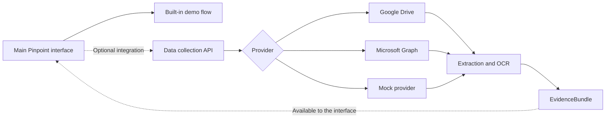

# Optional Data Collection Integration

> **Supporting module:** the main Pinpoint product and hackathon experience live
> in [`code/interface`](../interface). This service is not required for the
> default demo. It demonstrates how the product can connect to real enterprise
> document sources when an organization chooses to enable that capability.

The interface remains the primary product: it understands the user's question,
explains source trust and presents the final experience. This module provides an
optional integration boundary behind it. It accepts the interface's
`SearchBrief`, retrieves relevant documents, extracts their text and returns a
provider-neutral `EvidenceBundle` for downstream use.

## Role in Pinpoint

| Main interface | Optional data collection support |
| --- | --- |
| User experience and search brief | External provider connectivity |
| Trust explanation and results | Document discovery and download |
| Stable built-in hackathon demo | Full-text extraction and OCR |
| Final presentation layer | Normalized evidence and metadata |

This separation keeps the main demo fast and dependable while showing that the
same product can be extended beyond fixture data without redesigning the UI.



## What this module adds

- Searches Google Drive, Microsoft Graph or deterministic mock data.
- Downloads and extracts TXT, Markdown, JSON, CSV, PDF, DOCX and XLSX content.
- Uses Google Document AI as an optional OCR fallback for scans and images.
- Ranks documents and selects the most relevant passages.
- Preserves source metadata, timestamps, hashes, warnings and retrieval scores.
- Keeps provider credentials and API tokens on the server.

## Demo positioning

The recommended hackathon demo uses the main interface as the complete product.
This folder can then be shown as technical proof that Pinpoint is ready to plug
into real document systems:

> Pinpoint works as a self-contained demo today. When real enterprise data is
> available, the optional data-collection layer can retrieve documents from
> Google Drive or Microsoft Graph, use OCR where necessary and pass structured
> evidence into the same product experience.

Enabling this service is therefore an integration choice, not a prerequisite
for running or presenting Pinpoint.

## API

```text
GET  /health
POST /api/v1/evidence/collect
```

Example request:

```json
{
  "question": "What is the December payroll change deadline?",
  "topic_tags": ["payroll", "deadline", "december"],
  "scope": {
    "country": "BE",
    "client": "Acme"
  },
  "reference_date": "2026-09-30",
  "source_types": ["policy", "manual", "email"]
}
```

Each returned document contains:

- `content.full_text`: complete extracted text, subject to the configured limit.
- `content.relevant_passages`: the strongest matching excerpts.
- `metadata`: source IDs, dates, author, status, hash and provider fields.
- `retrieval_scores`: provider rank and local relevance signals.

Trust scoring and final answer generation intentionally remain outside this
service. This boundary returns evidence without inventing missing metadata.

## Run locally

```bash
python3 -m venv .venv
source .venv/bin/activate
pip install -r requirements.txt
cp .env.example .env
uvicorn api:app --reload --port 8080
```

Run the deterministic demo:

```bash
python demo.py
```

Run tests:

```bash
python -m unittest discover -s tests -v
```

## Configuration

| Variable | Purpose |
| --- | --- |
| `DATA_COLLECTION_PROVIDER` | `mock`, `google_drive` or `microsoft_graph` |
| `DATA_COLLECTION_API_TOKEN` | Optional local, required for deployed service-to-service access |
| `GOOGLE_DRIVE_API_KEY` | API key for the public Google Drive demo provider |
| `GOOGLE_DRIVE_FOLDER_ID` | Folder searched by the Google Drive provider |
| `GRAPH_TENANT_ID` | Microsoft Entra tenant |
| `GRAPH_CLIENT_ID` | Microsoft Entra application ID |
| `GRAPH_CLIENT_SECRET` | Microsoft Entra application secret |
| `DOCUMENT_AI_ENABLED` | Enables OCR fallback when set to `true` |
| `GOOGLE_CLOUD_PROJECT` | Google Cloud project for Document AI |
| `DOCUMENT_AI_LOCATION` | Document AI processor location |
| `DOCUMENT_AI_PROCESSOR_ID` | Document AI OCR processor ID |

See [.env.example](.env.example) for the complete template.

## Optional interface integration

If the integration is enabled, the browser should call a server-side interface
route, never this service with the shared bearer token directly. A ready-to-copy
Next.js route and exact setup instructions are included:

- [nextjs-evidence-route.ts](nextjs-evidence-route.ts)
- [INTEGRATION.md](INTEGRATION.md)

## Project structure

```text
api.py                    FastAPI endpoints and provider selection
adapter.py                SearchBrief to internal request mapping
contracts.py              Strict request and EvidenceBundle models
service.py                Retrieval, extraction and ranking orchestration
extractors.py             Local document parsers
document_ai_ocr.py        Optional Document AI OCR fallback
relevance.py              Explainable local relevance ranking
providers/                Provider-neutral interface and implementations
tests/                    Automated tests
```

## Deployment

The included Dockerfile runs the service on port `8080`. See
[CLOUD_RUN.md](CLOUD_RUN.md) for Secret Manager, service identity and Cloud Run
deployment details.

Local secrets, virtual environments, generated output and credentials are
excluded from Git and container build contexts.
